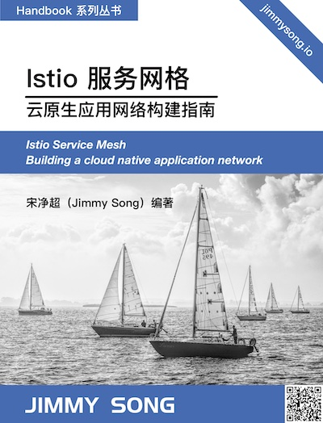

# Istio 服务网格——云原生应用网络构建指南

[Istio](https://istio.io) 是由 Google、IBM、Lyft 等共同开源的 Service Mesh（服务网格）框架，于2017 年开源。本书作为[《Kubernetes Handbook——Kubernetes 中文指南/云原生应用架构实践手册》](https://github.com/rootsongjc/kubernetes-handbook)的姊妹篇，希望读者在了解了 Kubernetes 的基础上阅读。

  

## 关于本书

本书的主题包括：

- 服务网格概念解析
- 控制平面和数据平面的原理
- Istio 架构详解
- 基于 Istio 的自定义扩展
- 迁移到 Istio 服务网格
- 构建云原生应用网络

## 如何阅读本书

本书基于 Istio 1.11+ 版本编写，您可以通过以下地址参与到本书的编写或阅读本书：

- [自行构建](https://github.com/rootsongjc/istio-handbook)
- [在线浏览](https://jimmysong.io/istio-handbook/)（推荐）

书中部分内容来自 Tetrate 出品的 [Istio 基础教程](https://academy.tetrate.io/courses/istio-fundamentals-zh)，请访问 [Tetrate 学院](https://academy.tetrate.io/)，解锁全部教程及测试，获得 Tetrate 认证的 Istio 认证。

## 致谢

感谢 [ServiceMesher](https://www.servicemesher.com) 及[云原生社区](https://cloudnative.to/)先后负责翻译了 [Envoy](https://cloudnative.to/envoy/) 及 [Istio](https://istio.io/latest/zh/) 官方文档，为本书的成书提供了大量参考资料。

## 许可证

本书所有内容支持使用[署名 - 非商业性使用 - 相同方式共享 4.0 (CC BY-NC-SA 4.0)](https://creativecommons.org/licenses/by-nc-sa/4.0/deed.zh)  协议共享。

## 参与本书

请参考 [Istio 文档样式指南](https://istio.io/latest/about/contribute/style-guide/)。

## 云原生社区

  

云原生社区是中国最大的独立第三方云原生终端用户和泛开发者社区，由 CNCF 大使、开源意见领袖共同发起成立于 2020 年 5 月 12 日，提供云原生专业资讯，促进云原生产业发展。

官方网站 <https://cloudnative.to>，关注云原生社区微信公众号，[申请加入社区](https://mp.weixin.qq.com/s/vWlSdzz2MNdXRr0sd2-LFg)。
