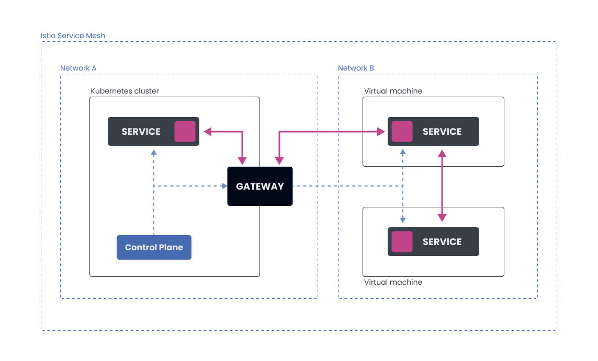

# 虚拟机负载

如果我们有在虚拟机上运行的工作负载，我们可以将它们连接到 Istio 服务网格，使其成为网格的一部分。

带有虚拟机的 Istio 服务网格有两种架构：单网络架构和多网络架构。

## 单网络架构

在这种情况下，有一个单一的网络。Kubernetes 集群和在虚拟机上运行的工作负载都在同一个网络中，它们可以直接相互通信。

单网络架构

控制面的流量（配置更新、证书签署）是通过 Gateway 发送的。

虚拟机被配置了网关地址，所以它们在启动时可以连接到控制平面。

## 多网络架构

多网络架构横跨多个网络。Kubernetes 集群在一个网络内，而虚拟机则在另一个网络内。这使得 Kubernetes 集群中的 Pod 和虚拟机上的工作负载无法直接相互通信。

多网络架构

所有的流量，控制面和 pod 到工作服的流量都流经网关，网关作为两个网络之间的桥梁。

## Istio 中如何表示虚拟机工作负载？

在 Istio 服务网格中，有两种方式来表示虚拟机工作负载。

工作负载组（`WorkloadGroup` 资源）类似于 Kubernetes 中的部署（Deployment），它代表了共享共同属性的虚拟机工作负载的逻辑组。

描述虚拟机工作负载的第二种方法是使用工作负载条目（`WorkloadEntry` 资源）。工作负载条目类似于 Pod，它代表了一个虚拟机工作负载的单一实例。

请注意，创建上述资源将不会提供或运行任何虚拟机工作负载实例。这些资源只是用来参考或指向虚拟机工作负载的。Istio 使用它们来了解如何适当地配置网格，将哪些服务添加到内部服务注册表中，等等。

为了将虚拟机添加到网格中，我们需要创建一个工作负载组，作为模板。然后，当我们配置并将虚拟机添加到网格中时，控制平面会自动创建一个相应的 WorkloadEntry。

我们已经提到，WorkloadEntry 的作用类似于 Pod。在添加虚拟机时，会创建 WorkloadEntry 资源，而当虚拟机的工作负载从网格中移除时，该资源会被自动删除。

除了 WorkloadEntry 资源外，我们还需要创建一个 Kubernetes 服务。创建一个 Kubernetes 服务给了我们一个稳定的主机名和 IP 地址，以便使用选择器字段访问虚拟机工作负载和 pod。这也使我们能够通过 DestinationRule 和 VirtualService 资源使用 Istio 的路由功能。
