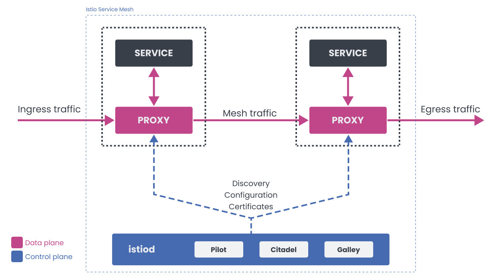

# Istio 简介

Istio 是一个服务网格的开源实现。从宏观上来看 Istio 支持以下功能。

**1. 流量管理**

利用配置，我们可以控制服务间的流量。设置断路器、超时或重试都可以通过简单的配置改变来完成。

**2. 可观察性**

Istio 通过跟踪、监控和记录让我们更好地了解你的服务，它让我们能够快速发现和修复问题。

**3. 安全性**

Istio 可以在代理层面上管理认证、授权和通信的加密。我们可以通过快速的配置变更在各个服务中执行政策。

## Istio 组件

Istio 服务网格有两个部分：数据平面和控制平面。

在构建分布式系统时，将组件分离成控制平面和数据平面是一种常见的模式。数据平面的组件在请求路径上，而控制平面的组件则帮助数据平面完成其工作。

Istio 中的数据平面由 Envoy 代理组成，控制服务之间的通信。网格的控制平面部分负责管理和配置代理。

### Envoy（数据平面）

Envoy 是一个用 C++ 开发的高性能代理。Istio 服务网格将 Envoy 代理作为一个 sidecar 容器注入到你的应用容器旁边。然后该代理拦截该服务的所有入站和出站流量。注入的代理一起构成了服务网格的数据平面。

Envoy 代理也是唯一与流量进行交互的组件。除了前面提到的功能 —— 负载均衡、断路器、故障注入等。Envoy 还支持基于 WebAssembly（WASM）的可插拔扩展模型。这种可扩展性使我们能够执行自定义策略，并为网格中的流量生成遥测数据。

### Istiod（控制平面）

Istiod 是控制平面组件，提供服务发现、配置和证书管理功能。Istiod 采用 YAML 编写的高级规则，并将其转换为 Envoy 的可操作配置。然后，它把这个配置传播给网格中的所有 sidecar。

Istiod 内部的 Pilot 组件抽象出特定平台的服务发现机制（Kubernetes、Consul 或 VM），并将其转换为 sidecar 可以使用的标准格式。

使用内置的身份和凭证管理，我们可以实现强大的服务间和终端用户认证。通过授权功能，我们可以控制谁可以访问你的服务。

控制平面的部分以前被称为 Citadel，作为一个证书授权机构，生成证书，允许数据平面中的代理之间进行安全的 mTLS 通信。