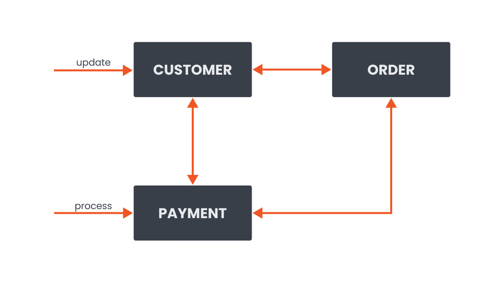
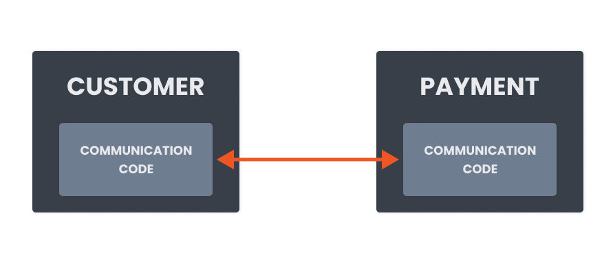
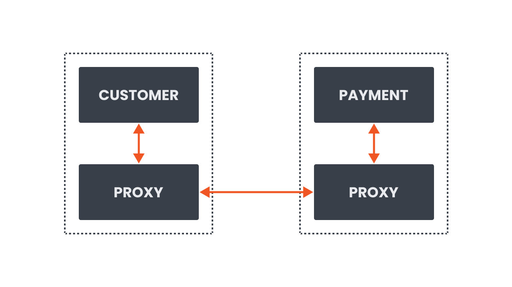

# 为什么要使用服务网格？

要想说明为什么要使用服务网格，那就要从微服务架构说起，可以说服务网格很大程度上是一种新一代的微服务架构，它解决了微服务中网络层操控性、弹性、可视性的问题。

## 微服务架构

开发人员经常将云原生应用程序分解为多个执行特定动作的服务。你可能有一个只处理客户的服务和另一个处理订单或付款的服务。所有这些服务都通过网络相互沟通。如果一个新的付款需要被处理，请求会被发送到付款服务。如果客户数据需要更新，请求会被发送到客户服务，等等。

这种类型的架构被称为微服务架构。这种架构有几个好处。你可以有多个较小的团队从事个别服务。这些团队可以灵活地选择他们的技术栈和语言，并且通常有独立部署和发布服务的自主权。这种机制得以运作得益于在其背后通信的网络。随着服务数量的增加，它们之间的通信和网络通信也在增加。服务和团队的数量使得监控和管理通信逻辑变得相当复杂。由于我们也知道网络是不可靠的，它们会失败，所有这些的结合使得微服务的管理和监控相当复杂。

## 服务网格概述

服务网格被定义为一个专门的基础设施层，用于管理服务与服务之间的通信，使其可管理、可见、可控制。在某些版本的定义中，你可能还会听到服务网格如何使服务间的通信安全和可靠。如果我必须用一个更直接的句子来描述服务网格，我会说，服务网格是关于服务之间的通信。

但是，服务网格是如何帮助通信的呢？让我们思考一下通信逻辑和它通常所在的地方。在大多数情况下，开发人员将这种逻辑作为服务的一部分来构建。通信逻辑是处理入站或出站请求的任何代码，重试逻辑，超时，甚至可能是流量路由。因此，无论何时服务 A 调用服务 B，请求都要经过这个通信代码逻辑，这个逻辑决定如何处理这个请求。

我们提到，如果我们采用微服务的方法，最终可能会有大量的服务。我们如何处理所有这些服务的通信逻辑呢？我们可以创建一个包含这种逻辑的共享库，并在多个地方重用它。假设我们对所有的服务都使用相同的堆栈或编程语言，共享库的方法可能会很有效。如果我们不这样做，我们将不得不重新实现这个库，这会带来巨大的工作量而且效率低下。你也可能使用自己本身不拥有代码库的服务。在这种情况下，我们无法控制通信逻辑或监控。

第二个问题是配置。除了配置你的应用程序外，我们还必须维护通信逻辑配置。如果我们需要同时调整或更新多个服务，我们将不得不为每个服务单独进行调整。

服务网格所做的是，它将这种通信逻辑、重试、超时等从单个服务中分离出来，并将其移到一个单独的基础设施层。在服务网格的情况下，基础设施层是一个网络代理的阵列。这些网络代理的集合（每个服务实例旁边都有一个）处理你的服务之间的所有通信逻辑。我们称这些代理为 sideecar，因为它们与每个服务并存。

以前，我们让 Customer 服务直接与 Payment 服务通信，现在我们有一个 Customer 服务旁边的代理与 Payment 服务旁边的代理通信。服务网格控制平面以这样一种方式配置代理，即它们透明地拦截所有入站和出站请求。这些代理的集合（基础设施层）形成了一个网络网格，称为服务网格。

将通信逻辑从业务和应用逻辑中分离出来，可以使开发人员专注于业务逻辑，而服务网格运维人员则专注于服务网格配置。

## 服务网格的功能

服务网格为我们提供了一种一致的方式来连接、保护和观察微服务。网格内的代理捕获了网格内所有通信的请求和指标。每一次失败、每一次成功的调用、重试或超时都可以被捕获、可视化，并发出警报。此外，可以根据请求属性做出决定。例如，我们可以检查入站（或出站）请求并编写规则，将所有具有特定头值的请求路由到不同的服务版本。

所有这些信息和收集到的指标使得一些场景可以合理地直接实现。开发人员和运营商可以配置和执行以下方案，而不需要对服务进行任何代码修改。

- mTLS 和自动证书轮换
- 使用指标识别性能和可靠性问题
- 在 Grafana 等工具中实现指标的可视化
- 使用 Jaeger 或 Zipkin（需要对代码进行小的修改，以便在服务之间传播跟踪头信息） 对服务进行调试和追踪
- 基于权重和请求的流量路由，金丝雀部署，A/B 测试
- 流量镜像
- 通过超时和重试提高服务的弹性
- 通过在服务之间注入故障和延迟来进行混沌测试
- 检测和弹出不健康的服务实例的断路器
