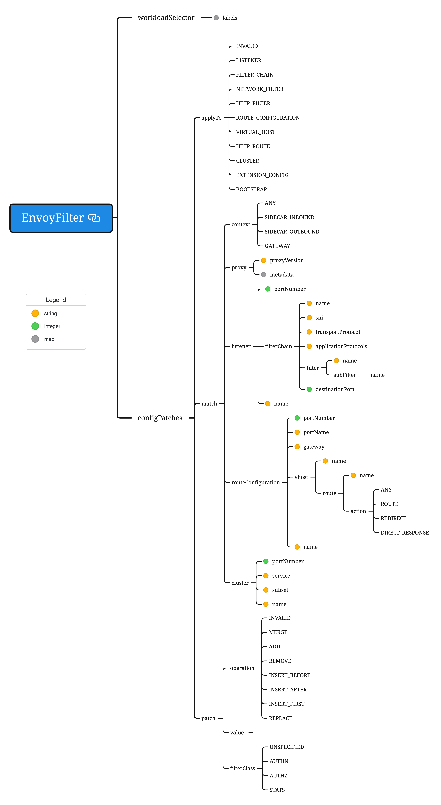

# EnvoyFilter

`EnvoyFilter` 提供了一种机制来定制 Istio Pilot 生成的 Envoy 配置。使用 EnvoyFilter 来修改某些字段的值，添加特定的过滤器，甚至添加全新的 listener、cluster 等。这个功能必须谨慎使用，因为不正确的配置可能破坏整个网格的稳定性。与其他 Istio 网络对象不同，EnvoyFilter 是累加应用。对于特定命名空间中的特定工作负载，可以存在任意数量的 EnvoyFilter。这些 EnvoyFilter 的应用顺序如下：配置[根命名空间](https://istio.io/latest/docs/reference/config/istio.mesh.v1alpha1/#MeshConfig)中的所有 EnvoyFilter，其次是工作负载命名空间中的所有匹配 EnvoyFilter。

### 注意一

该 API 的某些方面与 Istio 网络子系统的内部实现以及 Envoy 的 xDS API 有很深的关系。虽然 EnvoyFilter API 本身将保持向后兼容，但通过该机制提供的任何 Envoy 配置应在 Istio 代理版本升级时仔细审查，以确保废弃的字段被适当地删除和替换。

### 注意二

当多个 EnvoyFilter 被绑定到特定命名空间的同一个工作负载时，所有补丁将按照创建顺序处理。如果多个 EnvoyFilter 的配置相互冲突，则其行为将无法确定。

### 注意三

要将 EnvoyFilter 资源应用于系统中的所有工作负载（sidecar 和 gateway）上，请在 config [根命名空间](https://istio.io/latest/docs/reference/config/istio.mesh.v1alpha1/#MeshConfig)中定义该资源，不要使用 workloadSelector。

## 示例

下面的例子在名为 `istio-config` 的根命名空间中声明了一个全局默认的 EnvoyFilter 资源，在系统中的所有 sidecar 上添加了一个自定义的协议过滤器，用于 outbound 端口 9307。该过滤器应在终止 `tcp_proxy` 过滤器之前添加，以便生效。此外，它为 gateway 和 sidecar 的所有 HTTP 连接设置了 30 秒的空闲超时。

```yaml
apiVersion: networking.istio.io/v1alpha3
kind: EnvoyFilter
metadata:
  name: custom-protocol
  namespace: istio-config # 如在 meshConfig 资源中定义的。
spec:
  configPatches:
  - applyTo: NETWORK_FILTER
    match:
      context: SIDECAR_OUTBOUND # 将会匹配所有 sidecar 中的所有 outbound listener
      listener:
        portNumber: 9307
        filterChain:
          filter:
            name: "envoy.filters.network.tcp_proxy"
    patch:
      operation: INSERT_BEFORE
      value:
        # 这是完整的过滤器配置，包括名称和 typed_config 部分。
        name: "envoy.config.filter.network.custom_protocol"
        typed_config:
         ...
  - applyTo: NETWORK_FILTER # HTTP 连接管理器是 Envoy 的一个过滤器。
    match:
      # 省略了上下文，因此这同时适用于 sidecar 和 gateway。
      listener:
        filterChain:
          filter:
            name: "envoy.filters.network.http_connection_manager"
    patch:
      operation: MERGE
      value:
        name: "envoy.filters.network.http_connection_manager"
        typed_config:
          "@type": "type.googleapis.com/envoy.extensions.filters.network.http_connection_manager.v3.HttpConnectionManager"
          common_http_protocol_options:
            idle_timeout: 30s
```

下面的例子启用了 Envoy 的 Lua 过滤器，用于处理所有到达 bookinfo 命名空间中的对 reviews 服务 pod 的 8080 端口的 HTTP 调用，标签为 `app: reviews`。Lua 过滤器调用外部服务`internal.org.net:8888`，这需要在 Envoy 中定义一个特殊的 cluster。该 cluster 也被添加到 sidecar 中，作为该配置的一部分。

```yaml
apiVersion: networking.istio.io/v1alpha3
kind: EnvoyFilter
metadata:
  name: reviews-lua
  namespace: bookinfo
spec:
  workloadSelector:
    labels:
      app: reviews
  configPatches:
    # 第一个补丁将 lua过 滤器添加到监听器/http 连接管理器。
  - applyTo: HTTP_FILTER
    match:
      context: SIDECAR_INBOUND
      listener:
        portNumber: 8080
        filterChain:
          filter:
            name: "envoy.filters.network.http_connection_manager"
            subFilter:
              name: "envoy.filters.http.router"
    patch:
      operation: INSERT_BEFORE
      value: # lua 过滤器配置
       name: envoy.lua
       typed_config:
          "@type": "type.googleapis.com/envoy.extensions.filters.http.lua.v3.Lua"
          inlineCode: |
            function envoy_on_request(request_handle)
              -- 向上游主机进行 HTTP 调用，header、body 和 time欧特 如下。
              local headers, body = request_handle:httpCall(
               "lua_cluster",
               {
                [":method"] = "POST",
                [":path"] = "/acl",
                [":authority"] = "internal.org.net"
               },
              "authorize call",
              5000)
            end
  # 第二个补丁添加了被 lua 代码引用的 cluster，cds 匹配被省略，因为正在添加一个新的 cluster。
  - applyTo: CLUSTER
    match:
      context: SIDECAR_OUTBOUND
    patch:
      operation: ADD
      value: # cluster 配置
        name: "lua_cluster"
        type: STRICT_DNS
        connect_timeout: 0.5s
        lb_policy: ROUND_ROBIN
        load_assignment:
          cluster_name: lua_cluster
          endpoints:
          - lb_endpoints:
            - endpoint:
                address:
                  socket_address:
                    protocol: TCP
                    address: "internal.org.net"
                    port_value: 8888
```

下面的例子覆盖了 SNI 主机 `app.example.com` 在 `istio-system` 命名空间的 ingress gateway 的监听器中的 HTTP 连接管理器的某些字段（HTTP 空闲超时和`X-Forward-For`信任跳数）。

```yaml
apiVersion: networking.istio.io/v1alpha3
kind: EnvoyFilter
metadata:
  name: hcm-tweaks
  namespace: istio-system
spec:
  workloadSelector:
    labels:
      istio: ingressgateway
  configPatches:
  - applyTo: NETWORK_FILTER # HTTP 连接管理器是 Envoy 中的一个过滤器。 
    match:
      context: GATEWAY
      listener:
        filterChain:
          sni: app.example.com
          filter:
            name: "envoy.filters.network.http_connection_manager"
    patch:
      operation: MERGE
      value:
        typed_config:
          "@type": "type.googleapis.com/envoy.extensions.filters.network.http_connection_manager.v3.HttpConnectionManager"
          xff_num_trusted_hops: 5
          common_http_protocol_options:
            idle_timeout: 30s
```

下面的例子插入了一个产生 `istio_operationId` 属性的 attributegen 过滤器，该属性被 `istio.stats` fiter 消费。`filterClass:STATS` 对这种依赖关系进行编码。

```yaml
apiVersion: networking.istio.io/v1alpha3
kind: EnvoyFilter
metadata:
  name: reviews-request-operation
  namespace: myns
spec:
  workloadSelector:
    labels:
      app: reviews
  configPatches:
  - applyTo: HTTP_FILTER
    match:
      context: SIDECAR_INBOUND
    patch:
      operation: ADD
      filterClass: STATS # 这个过滤器将在 Istio 统计过滤器之前运行。
      value:
        name: istio.request_operation
        typed_config:
         "@type": type.googleapis.com/udpa.type.v1.TypedStruct
         type_url: type.googleapis.com/envoy.extensions.filters.http.wasm.v3.Wasm
         value:
           config:
             configuration: |
               {
                 "attributes": [
                   {
                     "output_attribute": "istio_operationId",
                     "match": [
                       {
                         "value": "ListReviews",
                         "condition": "request.url_path == '/reviews' && request.method == 'GET'"
                       }]
                   }]
               }
             vm_config:
               runtime: envoy.wasm.runtime.null
               code:
                 local: { inline_string: "envoy.wasm.attributegen" }
```

下面的例子在 `myns` 命名空间中插入了一个 http `ext_authz` 过滤器。

```yaml
apiVersion: networking.istio.io/v1alpha3
kind: EnvoyFilter
metadata:
  name: myns-ext-authz
  namespace: myns
spec:
  configPatches:
  - applyTo: HTTP_FILTER
    match:
      context: SIDECAR_INBOUND
    patch:
      operation: ADD
      filterClass: AUTHZ # 该过滤器将在 Istio authz 过滤器之后运行。
      value:
        name: envoy.filters.http.ext_authz
        typed_config:
          "@type": type.googleapis.com/envoy.extensions.filters.http.ext_authz.v3.ExtAuthz
          grpc_service:
            envoy_grpc:
              cluster_name: acme-ext-authz
            initial_metadata:
            - key: foo
              value: myauth.acme # 本地 ext auth 服务器要求的。
```

`myns` 命名空间中的一个工作负载需要访问一个不接受初始元数据的不同 `ext_auth`服务器。由于 proto merge 不能删除字段，下面的配置使用 `REPLACE` 操作。如果你不需要继承字段，REPLACE 比 MERGE 更适合。

```yaml
apiVersion: networking.istio.io/v1alpha3
kind: EnvoyFilter
metadata:
  name: mysvc-ext-authz
  namespace: myns
spec:
  workloadSelector:
    labels:
      app: mysvc
  configPatches:
  - applyTo: HTTP_FILTER
    match:
      context: SIDECAR_INBOUND
    patch:
      operation: REPLACE
      value:
        name: envoy.filters.http.ext_authz
        typed_config:
          "@type": type.googleapis.com/envoy.extensions.filters.http.ext_authz.v3.ExtAuthz
          grpc_service:
            envoy_grpc:
              cluster_name: acme-ext-authz-alt
```

下面的例子为所有 inbound 的 sidecar HTTP 请求部署了一个 Wasm 扩展。

```yaml
apiVersion: networking.istio.io/v1alpha3
kind: EnvoyFilter
metadata:
  name: wasm-example
  namespace: myns
spec:
  configPatches:
# 第一个补丁定义了一个 Wasm 扩展，并提供了一个 URL 来获取 Wasm 二进制文件，以及二进制配置。它应该出现在应用它的下一个补丁之前。这个资源对命名空间 "myns" 中的所有代理是可见的。有可能在多个命名空间为同一名称 "my-wasm-extension" 提供多个定义。我们建议，如果需要覆盖，那么可以用 REPLACE 覆盖每个命名空间的根级定义；如果不需要覆盖，那么这个名字应该用命名空间 "myns/my-wasm-extension" 来限定，以避免意外的名字冲突。
  - applyTo: EXTENSION_CONFIG
    patch:
      operation: ADD # REPLACE is also supported, and would override a cluster level resource with the same name.
      value:
        name: my-wasm-extension
        typed_config:
          "@type": type.googleapis.com/envoy.extensions.filters.http.wasm.v3.Wasm
          config:
            root_id: my-wasm-root-id
            vm_config:
              vm_id: my-wasm-vm-id
              runtime: envoy.wasm.runtime.v8
              code:
                remote:
                  http_uri:
                    uri: http://my-wasm-binary-uri
            configuration:
              "@type": "type.googleapis.com/google.protobuf.StringValue"
              value: |
                {}
  # 第二个补丁指示将上述 Wasm 过滤器应用于 listener/http 连接管理器。
  - applyTo: HTTP_FILTER
    match:
      context: SIDECAR_INBOUND
    patch:
      operation: ADD
      filterClass: AUTHZ # 这个过滤器将在 Istio authz 过滤器之后运行。
      value:
        name: my-wasm-extension # 这个必须匹配上面的名字。
        config_discovery:
          config_source:
            api_config_source:
              api_type: GRPC
              transport_api_version: V3
              grpc_services:
              - envoy_grpc:
                  cluster_name: xds-grpc
          type_urls: ["envoy.extensions.filters.http.wasm.v3.Wasm"]
```

## 配置项

下图是 EnvoyFilter 资源的配置拓扑图。



EnvoyFilter 资源的顶级配置项如下：

- `workloadSelector`：用于选择应用此补丁配置的特定 pod/VM 集合的标准。如果省略，该配置中的补丁集将被应用于同一命名空间的所有工作负载实例。如果省略，`EnvoyFilter` 补丁将被应用于同一命名空间的所有工作负载。如果 `EnvoyFilter` 存在于配置根命名空间中，它将被应用于所有命名空间中的所有适用工作负载。

- `configPatches`：一个或多个具有匹配条件的补丁。

- `priority`：优先级定义了在一个环境中应用补丁集的顺序。当一个补丁依赖于另一个补丁时，补丁的应用顺序是很重要的。API 提供了两种主要方式来排列补丁。根命名空间的补丁集在工作负载命名空间的补丁集之前应用。补丁集内的补丁是按照它们在 `configPatches` 列表中出现的顺序处理的。

  优先级的默认值是0，范围是 [ min-int32, max-int32 ]。优先级为负数的补丁集会在默认值之前被处理。优先级为正的补丁在默认值之后处理。

  建议从 10 的倍数的优先级值开始，以便为进一步插入留出空间。

  补丁集按以下升序排列：优先级、创建时间、完全限定的资源名称。

关于 EnvoyFilter 配置的详细用法请参考 [Istio 官方文档](https://istio.io/latest/docs/reference/config/networking/envoy-filter/)。

## 参考

- [EnvoyFilter - istio.io](https://istio.io/latest/docs/reference/config/networking/envoy-filter/)