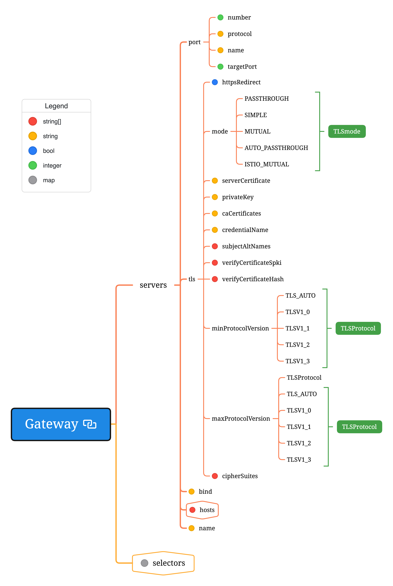

# Gateway

`Gateway` 描述了一个在网格边缘运行的负载均衡器，接收传入或传出的 HTTP/TCP 连接。该规范描述了一组应该暴露的端口、要使用的协议类型、负载均衡器的 SNI 配置等。

## 示例

例如，下面的 Gateway 配置设置了一个代理，作为负载均衡器，暴露了 80 和 9080 端口（http）、443（https）、9443（https）和 2379 端口（TCP）的入口（ingress）。网关将被应用于运行在标签为 `app: my-gateway-controller` 的 pod 上的代理。虽然 Istio 将配置代理来监听这些端口，但用户有责任确保这些端口的外部流量被允许进入网格。

```yaml
apiVersion: networking.istio.io/v1alpha3
kind: Gateway
metadata:
  name: my-gateway
  namespace: some-config-namespace
spec:
  selector:
    app: my-gateway-controller
  servers:
  - port:
      number: 80
      name: http
      protocol: HTTP
    hosts:
    - uk.bookinfo.com
    - eu.bookinfo.com
    tls:
      httpsRedirect: true # 对 HTTP 请求发送 301 重定向
  - port:
      number: 443
      name: https-443
      protocol: HTTPS
    hosts:
    - uk.bookinfo.com
    - eu.bookinfo.com
    tls:
      mode: SIMPLE # 在此端口上启用 HTTPS
      serverCertificate: /etc/certs/servercert.pem
      privateKey: /etc/certs/privatekey.pem
  - port:
      number: 9443
      name: https-9443
      protocol: HTTPS
    hosts:
    - "bookinfo-namespace/*.bookinfo.com"
    tls:
      mode: SIMPLE # 在此端口上启用 HTTPS
      credentialName: bookinfo-secret # 从 Kubernetes secret 中获取证书
  - port:
      number: 9080
      name: http-wildcard
      protocol: HTTP
    hosts:
    - "*"
  - port:
      number: 2379 # 通过此端口暴露内部服务
      name: mongo
      protocol: MONGO
    hosts:
    - "*"
```

上面的网关规范描述了负载均衡器的 L4 到 L6 属性。然后，VirtualService 可以被绑定到 Gateway 上，以控制到达特定主机或网关端口的流量的转发。

例如，下面的 VirtualService 将 `https://uk.bookinfo.com/reviews`、`https://eu.bookinfo.com/reviews`、 `http://uk.bookinfo.com:9080/reviews`、`http://eu.bookinfo.com:9080/reviews` 的流量分成两个版本（`prod` 和 `qa`）的内部 reviews 服务，这两个版本分别运行在 `prod` 和 `qa` 命名空间中，端口为 9080。此外，包含 cookie `user: dev-123` 的请求将被发送到 qa 版本的特殊端口 7777。以上规则也适用于网格内部对 `reviews.prod.svc.cluster.local` 服务的请求。`prod` 版本获得 80% 的流量，`qa` 版本获得 20% 的流量。

```yaml
apiVersion: networking.istio.io/v1alpha3
kind: VirtualService
metadata:
  name: bookinfo-rule
  namespace: bookinfo-namespace
spec:
  hosts:
  - reviews.prod.svc.cluster.local
  - uk.bookinfo.com
  - eu.bookinfo.com
  gateways:
  - some-config-namespace/my-gateway
  - mesh # 应用到网格中所有的 sidecar
  http:
  - match:
    - headers:
        cookie:
          exact: "user=dev-123"
    route:
    - destination:
        port:
          number: 7777
        host: reviews.qa.svc.cluster.local
  - match:
    - uri:
        prefix: /reviews/
    route:
    - destination:
        port:
          number: 9080 # 如果它是 reviews 的唯一端口，则可以省略。
        host: reviews.prod.svc.cluster.local
      weight: 80
    - destination:
        host: reviews.qa.svc.cluster.local
      weight: 20
```

下面的 VirtualService 将到达（外部）27017 端口的流量转发到 5555 端口的内部 Mongo 服务器。这个规则在网格内部不适用，因为网关列表中省略了保留名称 `mesh`。

```yaml
apiVersion: networking.istio.io/v1alpha3
kind: VirtualService
metadata:
  name: bookinfo-mongo
  namespace: bookinfo-namespace
spec:
  hosts:
  - mongosvr.prod.svc.cluster.local # 内部 Mongo 服务的名字
  gateways:
  - some-config-namespace/my-gateway # 如果 Gateway 与 VirtualService 处于同一命名空间，可以省略命名空间。
  tcp:
  - match:
    - port: 27017
    route:
    - destination:
        host: mongo.prod.svc.cluster.local
        port:
          number: 5555
```

可以在 `hosts` 字段中**命名空间/主机名**语法来限制可以绑定到网关服务器的虚拟服务集。例如，下面的 Gateway 允许 `ns1` 命名空间中的任何 VirtualService 与之绑定，而只限制 `ns2` 命名空间中的 `foo.bar.com` 主机的 VirtualService 与之绑定。

```yaml
apiVersion: networking.istio.io/v1alpha3
kind: Gateway
metadata:
  name: my-gateway
  namespace: some-config-namespace
spec:
  selector:
    app: my-gateway-controller
  servers:
  - port:
      number: 80
      name: http
      protocol: HTTP
    hosts:
    - "ns1/*"
    - "ns2/foo.bar.com"
```

## 配置项

下图是 Gateway 资源的配置拓扑图。



Gateway 资源的顶级配置项目如下：

- `selector`：一个或多个标签，表明应在其上应用该网关配置的一组特定的 pod/VM。默认情况下，工作负载是根据标签选择器在所有命名空间中搜索的。这意味着命名空间 "foo" 中的网关资源可以根据标签选择命名空间 "bar" 中的 pod。这种行为可以通过 istiod 中的 `PILOT_SCOPE_GATEWAY_TO_NAMESPACE` 环境变量控制。如果这个变量被设置为 "true"，标签搜索的范围将被限制在资源所在的配置命名空间。换句话说，Gateway 资源必须驻留在与 Gateway 工作负载实例相同的命名空间中。如果选择器为nil，Gateway 将被应用于所有工作负载。
- `servers`：描述了特定负载均衡器端口上的代理的属性。

关于 Gateway 配置的详细用法请参考 [Istio 官方文档](https://istio.io/latest/docs/reference/config/networking/gateway/)。

## 参考

- [Gateway - istio.io](https://istio.io/latest/docs/reference/config/networking/gateway/)