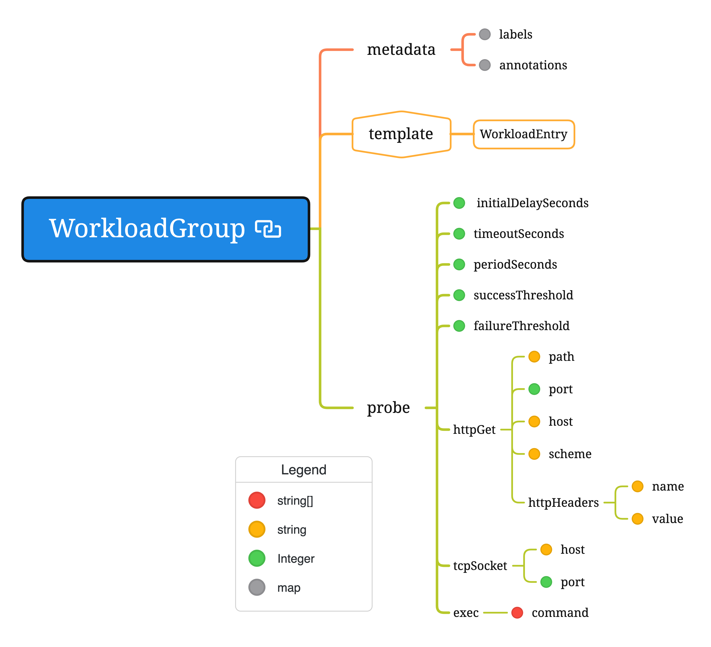

# WorkloadGroup

`WorkloadGroup` 描述了工作负载实例的集合。它提供了一个规范，工作负载实例可用于启动其代理，包括元数据和身份。它只适用于虚拟机等非 Kubernetes 工作负载，旨在模仿现有的用于 Kubernetes 工作负载的 sidecar 注入和部署规范模型，以引导 Istio 代理。

## 示例

下面的例子声明了一个代表工作负载集合的工作负载组，这些工作负载将在 `bookinfo` 命名空间的 reviews 下注册。在引导过程中，这组标签将与每个工作负载实例相关联，端口 3550 和 8080 将与工作负载组相关联，并使用 default 服务账户。`app.kubernetes.io/version` 只是一个标签的例子。

```yaml
apiVersion: networking.istio.io/v1alpha3
kind: WorkloadGroup
metadata:
  name: reviews
  namespace: bookinfo
spec:
  metadata:
    labels:
      app.kubernetes.io/name: reviews
      app.kubernetes.io/version: "1.3.4"
  template:
    ports:
      grpc: 3550
      http: 8080
    serviceAccount: default
  probe:
    initialDelaySeconds: 5
    timeoutSeconds: 3
    periodSeconds: 4
    successThreshold: 3
    failureThreshold: 3
    httpGet:
     path: /foo/bar
     host: 127.0.0.1
     port: 3100
     scheme: HTTPS
     httpHeaders:
     - name: Lit-Header
       value: Im-The-Best
```

## 配置项

下图是 WorkloadGroup 资源的配置拓扑图。



WorkloadGroup 资源的顶级配置项如下：

- `metadata`：元数据，将用于所有相应的 WorkloadEntry。WorkloadGroup 的用户标签应在 `metadata` 中而不是在 `template` 中设置。
- `template`：用于生成属于该 WorkloadGroup 的 WorkloadEntry 资源的模板。请注意，模板中不应设置 `address` 和 `labels` 字段，而空的 `serviceAccount` 的默认值为 `default`。工作负载身份（mTLS 证书）将使用指定服务账户的令牌进行引导。该组中的 WorkloadEntry 将与 WorkloadGroup 处于同一命名空间，并继承上述 `metadata` 字段中的标签和注释。
- `probe`：`ReadinessProbe` 描述了用户必须为其工作负载的健康检查提供的配置。这个配置在语法和逻辑上大部分都与 K8s 一致。

关于 WorkloadGroup 配置的详细用法请参考 [Istio 官方文档](https://istio.io/latest/docs/reference/config/networking/workload-group/)。

## 参考

- [WorkloadGroup - istio.io](https://istio.io/latest/docs/reference/config/networking/workload-group/)