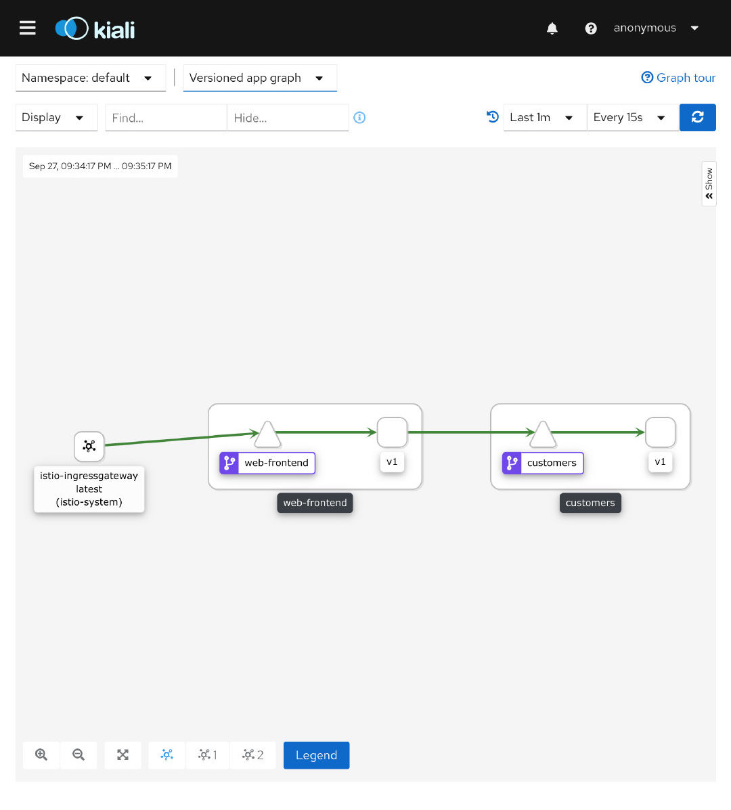

# Kiali

[Kiali](https://www.kiali.io/) 是一个基于 Istio 的服务网格的管理控制台。它提供了仪表盘、可观察性，并让我们通过强大的配置和验证能力来操作网格。它通过推断流量拓扑来显示服务网格，并显示网格的健康状况。Kiali 提供了详细的指标，强大的验证，Grafana 访问，以及与 Jaeger 的分布式跟踪的强大集成。

要安装 Kiali，请使用 addons 文件夹中的 `kiali.yaml` 文件：

```sh
$ kubectl apply -f istio-1.9.0/samples/addons/kiali.yaml
customresourcedefinition.apiextensions.k8s.io/monitoringdashboards.monito
ring.kiali.io created
serviceaccount/kiali created
configmap/kiali created
clusterrole.rbac.authorization.k8s.io/kiali-viewer created
clusterrole.rbac.authorization.k8s.io/kiali created
clusterrolebinding.rbac.authorization.k8s.io/kiali created
service/kiali created
deployment.apps/kiali created
```

注意，如果你看到任何错误，例如在版本 `monitoringkiali.io/v1alpha` 中没有匹配的 `MonitoringDashboard`，请再次重新运行 `kubectl apply` 命令。问题是，在安装 CRD（自定义资源定义）和由该 CRD 定义的资源时，可能存在一个匹配条件。

我们可以用 `getmesh istioctl dashboard kiali` 打开 Kiali。

Kiali 可以生成一个像下图这样的服务图。



该图向我们展示了服务的拓扑结构，并将服务的通信方式可视化。它还显示了入站和出站的指标，以及通过连接 Jaeger 和 Grafana（如果安装了）的追踪。图中的颜色代表服务网格的健康状况。颜色为红色或橙色的节点可能需要注意。组件之间的边的颜色代表这些组件之间的请求的健康状况。节点形状表示组件的类型，如服务、工作负载或应用程序。

节点和边的健康状况会根据用户的偏好自动刷新。该图也可以暂停以检查一个特定的状态，或重放以重新检查一个特定的时期。

Kiali 提供创建、更新和删除 Istio 配置的操作，由向导驱动。我们可以配置请求路由、故障注入、流量转移和请求超时，所有这些都来自用户界面。如果我们有任何现有的 Istio 配置已经部署，Kiali 可以验证它并报告任何警告或错误。