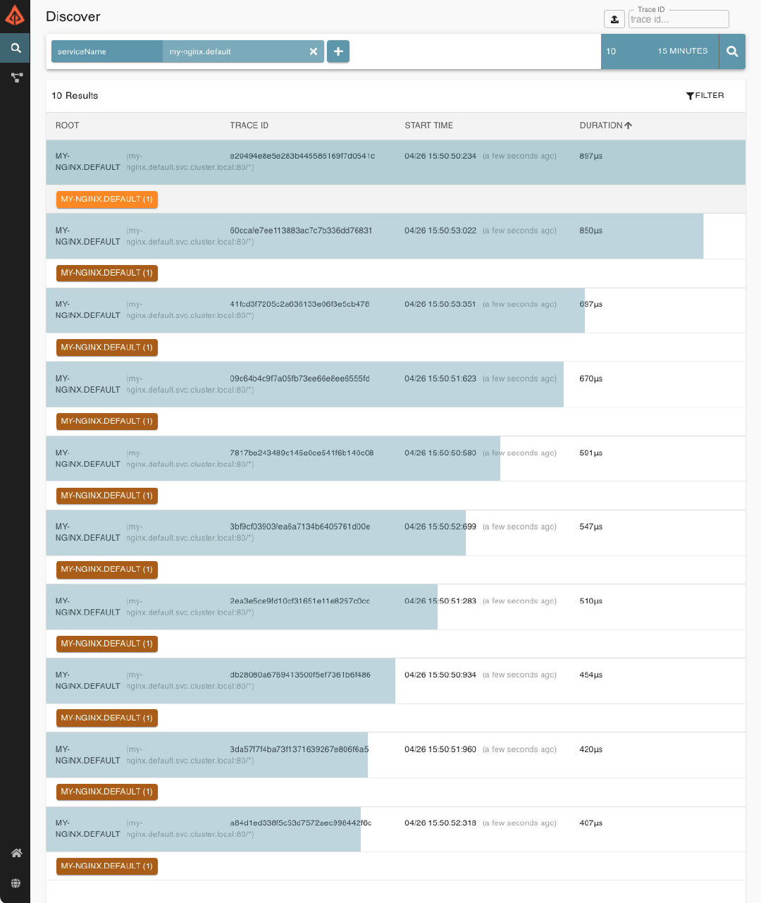
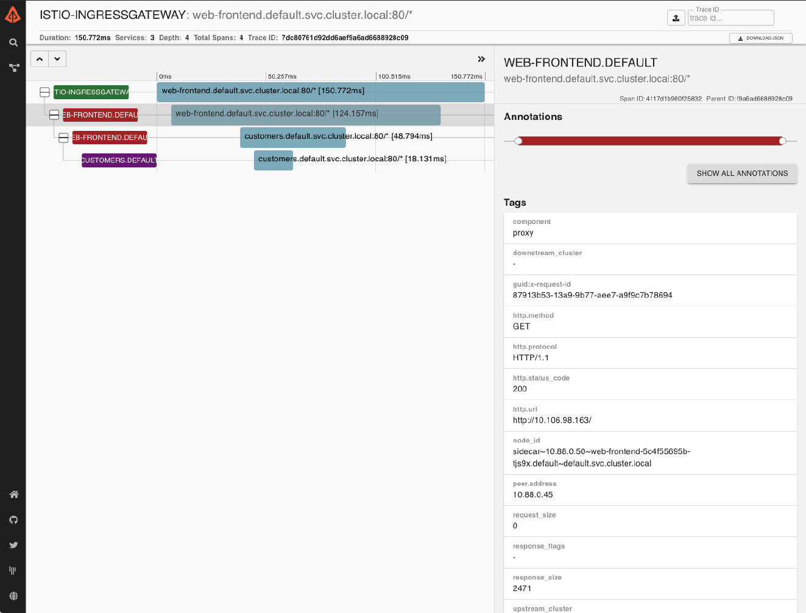

# Zipkin

分布式追踪是一种监测微服务应用程序的方法。使用分布式追踪，我们可以在请求通过被监控系统的不同部分时追踪它们。

每当一个请求进入服务网格时，Envoy 都会生成一个唯一的请求 ID 和追踪信息，并将其作为 HTTP 头的一部分来存储。任何应用程序都可以将这些头信息转发给它所调用的其他服务，以便在系统中创建一个完整的追踪。

分布式追踪是一个跨度（span）的集合。当请求流经不同的系统组件时，每个组件都会贡献一个跨度。每个跨度都有一个名称，开始和结束的时间戳，一组称为标签（tag）和日志（log）的键值对，以及一个跨度上下文。

标签被应用于整个跨度，并用于查询和过滤。下面是我们在使用 Zipkin 时将看到的几个标签的例子。注意，其中有些是通用的，有些是 Istio 特有的。

- `istio.mesh_id`
- `istio.canonical_service`
- `upstream_cluster`
- `http.url`
- `http.status_code`
- `zone`

单个跨度与识别跨度、父跨度、追踪 ID 的上下文头一起被发送到一个叫做采集器的组件。采集器对数据进行验证、索引和存储。

当请求流经 Envoy 代理时，Envoy 代理会自动发送各个跨度。请注意，Envoy 只能在边缘收集跨度。我们要负责在每个应用程序中生成任何额外的跨度，并确保我们在调用其他服务时转发追踪头信息。这样一来，各个跨度就可以正确地关联到一个单一的追踪中。

## 使用 Zipkin 进行分布式追踪

[Zipkin](http://zipkin.io/) 是一个分布式跟踪系统。我们可以轻松地监控服务网格中发生的分布式事务，发现任何性能或延迟问题。

为了让我们的服务参与分布式跟踪，我们需要在进行任何下游服务调用时传播服务的 HTTP 头信息。尽管所有的请求都要经过 Istio sidecar，但 Istio 没有办法将出站请求与产生这些请求的入站请求联系起来。通过在应用程序中传播相关的头信息可以帮助 Zipkin 将这些跟踪信息拼接起来。

Istio 依赖于 B3 跟踪头（以 `x-b3` 开头的 header）和 Envoy 生成的请求 ID（`x-request-id`）。B3 头信息用于跨服务边界的跟踪上下文传播。

以下是我们需要在我们的应用程序中对每个发出的请求进行传播的特定头文件名称：

```sh
x-request-id
x-b3-traceid
x-b3-spanid
x-b3-parentspanid
x-b3-sampled
x-b3-flags
b3
```

> 如果你使用 Lightstep，你还需要转发名为 `x-ot-span-context` 的头。

传播头信息最常见的方法是从传入的请求中复制它们，并将它们包含在所有从你的应用程序发出的请求中。

你用 Istio 服务网格得到的跟踪只在服务边界捕获。为了了解应用程序的行为并排除故障，你需要通过创建额外的跨度（span）来正确检测你的应用程序。

要安装 Zipkin，我们可以使用 addons 文件夹中的 `zipkin.yaml` 文件。

```sh
$ kubectl apply -f istio-1.9.0/samples/addons/extras/zipkin.yaml
deployment.apps/zipkin created
service/tracing created
service/zipkin created
```

我们可以通过运行 `getmesh istioctl dashboard zipkin` 来打开 Zipkin 仪表板。在用户界面上，我们可以选择跟踪查询的标准。点击按钮，从下拉菜单中选择 `serviceName`，然后选择 `customers.default` service，点击搜索按钮（或按回车键），就可以搜索到 trace 信息。



我们可以点击个别 trace 来深入挖掘不同的跨度。详细的视图将显示服务之间的调用时间，以及请求的细节，如方法、协议、状态码等。由于我们只有一个服务在运行（Nginx），所以你不会看到很多细节。稍后，我们将回到 Zipkin，更详细地探索这些 trace。


