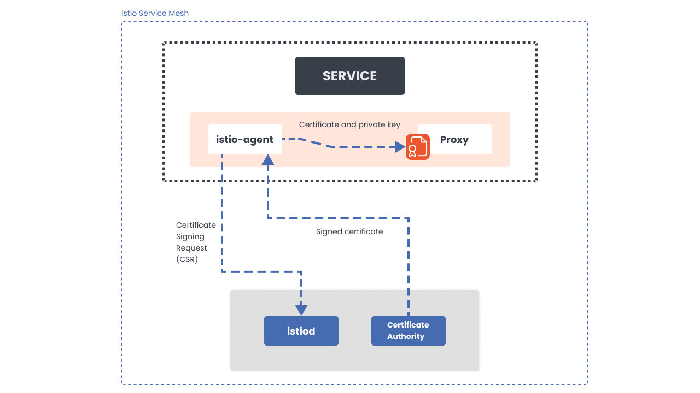
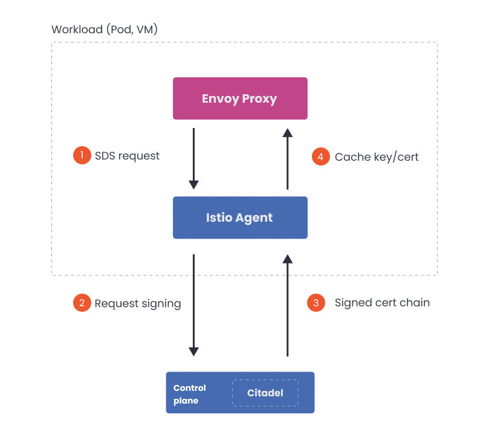

# 认证

为了解释什么是认证或 authn，我们将从访问控制试图回答的问题开始：一个主体能否对一个对象执行操作？

如果我们把上述问题翻译成 Istio 和 Kubernetes 的世界，它将是 "服务 X 能否对服务 Y 进行操作？"

这个问题的三个关键部分是：主体、动作和对象。

主体和对象都是 Kubernetes 中的服务。动作，假设我们谈论的是 HTTP，是一个 GET 请求，一个 POST，一个 PUT 等等。

认证是关于主体（或者在我们的例子中是服务的身份）的。认证是验证某种凭证的行为，并确保该凭证是有效和可信的。一旦进行了认证，我们就有了一个经过认证的主体。下次你旅行时，你向海关官员出示你的护照或身份证，他们会对其进行认证，确保你的凭证（护照或身份证）是有效和可信的。

在 Kubernetes 中，每个工作负载都被分配了一个独特的身份，它用来与其他每个工作负载进行通信 - 该身份以服务账户的形式提供给工作负载。服务账户是运行时中存在的身份 Pods。

Istio 使用来自服务账户的 X.509 证书，它根据名为 SPIFFE（每个人的安全生产身份框架）的规范创建一个新的身份。

证书中的身份被编码在证书的 Subject alternate name 字段中，它看起来像这样。

```
spiffe://cluster.local/ns/<pod namespace>/sa/<pod service account>
```

当两个服务开始通信时，它们需要交换带有身份信息的凭证，以相互验证自己。客户端根据安全命名信息检查服务器的身份，看它是否是服务的授权运行者。

服务器根据授权策略确定客户可以访问哪些信息。此外，服务器可以审计谁在什么时间访问了什么，并决定是否批准或拒绝客户对服务器的调用。

安全命名信息包含从服务身份到服务名称的映射。服务器身份是在证书中编码的，而服务名称是由发现服务或 DNS 使用的名称。从一个身份 A 到一个服务名称 B 的单一映射意味着 "A 被允许和授权运行服务 B"。安全命名信息由 Pilot 生成，然后分发给所有 sidecar 代理。

### 证书创建和轮换

对于网格中的每个工作负载，Istio 提供一个 X.509 证书。一个名为 `pilot-agent` 的代理在每个 Envoy 代理旁边运行，并与控制平面（`istiod`）一起工作，自动进行密钥和证书的轮转。



在运行时创建身份时，有三个部分在起作用：

- Citadel（控制平面的一部分）
- Istio 代理
- Envoy 的秘密发现服务（SDS）

Istio Agent 与 Envoy sidecar 一起工作，通过安全地传递配置和秘密，帮助它们连接到服务网格。即使 Istio 代理在每个 pod 中运行，我们也认为它是控制平面的一部分。

秘密发现服务（SDS）简化了证书管理。如果没有 SDS，证书必须作为秘密（Secret）创建，然后装入代理容器的文件系统中。当证书过期时，需要更新秘密，并重新部署代理，因为 Envoy 不会从磁盘动态重新加载证书。当使用 SDS 时，SDS 服务器将证书推送给 Envoy 实例。每当证书过期时，SDS 会推送更新的证书，Envoy 可以立即使用它们。不需要重新部署代理服务器，也不需要中断流量。在 Istio 中，Istio Agent 作为 SDS 服务器，实现了秘密发现服务接口。

每次我们创建一个新的服务账户时，Citadel 都会为它创建一个 SPIFFE 身份。每当我们安排一个工作负载时，Pilot 会用包括工作负载的服务账户在内的初始化信息来配置其 sidecar。

当工作负载旁边的 Envoy 代理启动时，它会联系 Istio 代理并告诉它工作负载的服务账户。代理验证该实例，生成 CSR（证书签名请求），将 CSR 以及工作负载的服务账户证明（在 Kubernetes 中，是 pod 的服务账户 JWT）发送给 Citadel。Citadel 将执行认证和授权，并以签名的 X.509 证书作为回应。Istio 代理从 Citadel 获取响应，将密钥和证书缓存在内存中，并通过 SDS 通过 Unix 域套接字将其提供给 Envoy。将密钥存储在内存中比存储在磁盘上更安全；在使用 SDS 时，Istio 绝不会将任何密钥写入磁盘作为其操作的一部分。Istio 代理还定期刷新凭证，在当前凭证过期前从 Citadel 检索任何新的 SVID（SPIFFE 可验证身份文件）。



> SVID 是一个工作负载可以用来向资源或调用者证明其身份的文件。它必须由一个权威机构签署，并包含一个 SPIFFE ID，它代表了提出该文件的服务的身份，例如，`spiffe://clusterlocal/ns/my-namespace/sa/my-sa`。

这种解决方案是可扩展的，因为流程中的每个组件只负责一部分工作。例如，Envoy 负责过期证书，Istio 代理负责生成私钥和 CSR，Citadel 负责授权和签署证书。