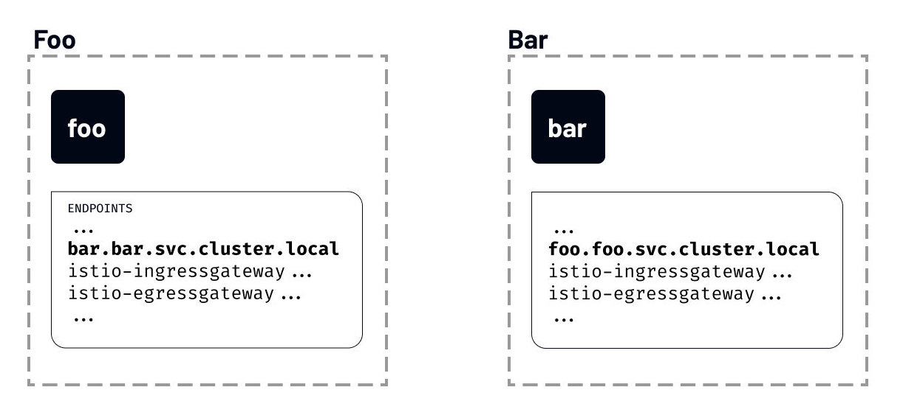

# GetMesh

Istio 是最受欢迎和发展最快的开源项目之一。它的发布时间表对企业的生命周期和变更管理实践来说可能非常激进。GetMesh 通过针对不同的 Kubernetes 分发版测试所有 Istio 版本以确保功能的完整性来解决这一问题。GetMesh 的 Istio 版本在安全补丁和其他错误更新方面得到积极的支持，并拥有比上游 Istio 提供的更长的支持期。

一些服务网格客户需要支持更高的安全要求。GetMesh 通过提供两种 Istio 发行版来解决合规性问题。

- `tetrate` 发行版，跟踪上游 Istio 并可能应用额外的补丁。
- `tetratefips` 发行版，是符合 FIPS 标准的 tetrate 版本。

### 如何开始使用？

第一步是下载 GetMesh CLI。你可以在 macOS 和 Linux 平台上安装 GetMesh。我们可以使用以下命令来下载最新版本的 GetMesh 和认证的 Istio。

### 如何开始？

第一步是下载 GetMesh CLI。你可以在 macOS 和 Linux 平台上安装 GetMesh。我们可以使用以下命令下载最新版本的 GetMesh 并认证 Istio。

```sh
curl -sL https://istio.tetratelabs.io/getmesh/install.sh | bash
```

我们可以运行 `version` 命令以确保 GetMesh 被成功安装。例如：

```sh
$ getmesh version
getmesh version: 1.1.1
active istioctl: 1.8.3-tetrate-v0
no running Istio pods in "istio-system"
```

版本命令输出 GetMesh 的版本、活跃的 Istio CLI 的版本以及 Kubernetes 集群上安装的 Istio 的版本。

### 使用 GetMesh 安装 Istio

GetMesh 通过 Kubernetes 配置文件与活跃的 Kubernetes 集群进行通信。

要在当前活动的 Kubernetes 集群上安装 Istio 的演示配置文件，我们可以像这样使用 `getmesh istioctl` 命令：

```sh
getmesh istioctl install --set profile=demo
```

该命令将检查集群，以确保它准备好安装 Istio，一旦你确认，安装程序将继续使用选定的配置文件安装 Istio。

如果我们现在检查版本，你会注意到输出显示控制平面和数据平面的版本。

### 验证配置

`config-validate` 命令允许你对当前配置和任何尚未应用的 YAML 清单进行验证。

该命令使用外部资源调用一系列验证，如上游 Istio 验证、Kiali 库和 GetMesh 自定义配置检查。

下面是一个命令输出的例子，如果没有标记为 Istio 注入的命名空间。

```bash
$ getmesh config-validate
Running the config validator. This may take some time...

2021-08-02T19:20:33.873244Z     info    klog    Throttling request took 1.196458809s, request: GET:https://35.185.226.9/api/v1/namespaces/istio-system/configmaps/istio[]
NAMESPACE       NAME    RESOURCE TYPE   ERROR CODE      SEVERITY        MESSAGE                                     
default         default Namespace       IST0102         Info            The namespace is not enabled for Istio injection. Run 'kubectl label namespace default istio-injection=enabled' to enable it, or 'kubectl label namespace default istio-injection=disabled' to explicitly mark it as not needing injection.

The error codes of the found issues are prefixed by 'IST' or 'KIA'. For the detailed explanation, please refer to
- https://istio.io/latest/docs/reference/config/analysis/ for 'IST' error codes
- https://kiali.io/documentation/latest/validations/ for 'KIA' error codes
```

同样，你也可以传入一个 YAML 文件来验证它，然后再将它部署到集群。例如：

```sh
$ getmesh config-validate my-resources.yaml
```

### 管理多个 Istio CLI

我们可以使用 show 命令来列出当前下载的 Istio 版本：

```sh
getmesh show
```

输出如下所示：

```
1.8.2-tetrate-v0
1.8.3-tetrate-v0 (Active)
```

如果我们想使用的版本在电脑上没有，我们可以使用 `getmesh list` 命令来列出所有可信的 Istio 版本：

```sh
$ getmesh list
ISTIO VERSION     FLAVOR        FLAVOR VERSION     K8S VERSIONS
   *1.9.5         tetrate             0         1.17,1.18,1.19,1.20
    1.9.5          istio              0         1.17,1.18,1.19,1.20
    1.9.4         tetrate             0         1.17,1.18,1.19,1.20
    1.9.4          istio              0         1.17,1.18,1.19,1.20
    1.9.0         tetrate             0         1.17,1.18,1.19,1.20
    1.9.0       tetratefips           1         1.17,1.18,1.19,1.20
    1.9.0          istio              0         1.17,1.18,1.19,1.20
    1.8.6         tetrate             0         1.16,1.17,1.18,1.19
    1.8.6          istio              0         1.16,1.17,1.18,1.19
    1.8.5         tetrate             0         1.16,1.17,1.18,1.19
    1.8.5          istio              0         1.16,1.17,1.18,1.19
    1.8.3         tetrate             0         1.16,1.17,1.18,1.19
    1.8.3       tetratefips           1         1.16,1.17,1.18,1.19
    1.8.3          istio              0         1.16,1.17,1.18,1.19
    1.7.8         tetrate             0           1.16,1.17,1.18
    1.7.8          istio              0           1.16,1.17,1.18
```

要获取一个特定的版本（比方说1.8.2 `tetratefips`），我们可以使用 `fetch` 命令：

```sh
getmesh fetch --version 1.9.0 --flavor tetratefips  --flavor-version 1
```

当上述命令完成后，GetMesh 将获取的 Istio CLI 版本设置为 Istio CLI 的活动版本。例如，运行 show 命令现在显示 `tetratefips` 1.9.0 版本是活跃的：

```sh
$ getmesh show
1.9.0-tetratefips-v1 (Active)
1.9.5-tetrate-v0
```

同样，如果我们运行 `getmesh istioctl version` ，我们会发现正在使用的 Istio CLI 的版本：

```sh
$ getmesh istioctl version
client version: 1.9.0-tetratefips-v1
control plane version: 1.9.5-tetrate-v0
data plane version: 1.9.5-tetrate-v0 (2 proxies)
```

要切换到不同版本的 Istio CLI，我们可以运行 `getmesh switch` 命令：

```sh
getmesh  switch --version 1.9.5 --flavor tetrate --flavor-version 0
```

### CA 集成

我们没有使用自签的根证书，而是从 GCP CAS（证书授权服务）获得一个中间的 Istio 证书授权（CA）来签署工作负载证书。

假设你已经配置了你的 CAS 实例，你可以用 CA 的参数创建一个 YAML 配置。下面是 YAML 配置的一个例子：

```yaml
providerName: "gcp"
providerConfig:
  gcp:
    # 这将持有你在 GCP 上创建的证书授权的完整 CA 名称
    casCAName: "projects/tetrate-io-istio/locations/us-west1/certificateAuthorities/tetrate-example-io"

certificateParameters:
  secretOptions:
    istioCANamespace: "istio-system" # `cacerts` secrets 所在的命名空间
    overrideExistingCACertsSecret: true # 重写已存在的 `cacerts` secret，使用新的替换
  caOptions:
    validityDays: 365 # CA 到期前的有效天数
    keyLength: 2048 # 创建的 key 的比特数
    certSigningRequestParams: # x509.CertificateRequest；大部分字段省略
      subject:
        commonname: "tetrate.example.io"
        country: 
          - "US"
        locality:
          - "Sunnyvale"
        organization:
          - "Istio"
        organizationunit:
          - "engineering"
      emailaddresses:
        - "youremail@example.io"
```

配置到位后，你可以使用 `gen-ca` 命令来创建 `cacert`。

```sh
getmesh gen-ca --config-file gcp-cas-config.yaml
```

该命令在 `istio-system` 中创建 `cacerts` Kubernetes Secret。为了让 `istiod` 接受新的 cert，你必须重新启动 istiod。

如果你创建一个 sample 工作负载，并检查所使用的证书，你会发现 CA 是发布工作负载的那个。

Istio CA certs 集成可用于 [GCP CA 服务](https://istio.tetratelabs.io/istio-ca-certs-integrations/gcp-cas-integration/)和 [AWS Private CA 服务](https://istio.tetratelabs.io/istio-ca-certs-integrations/acmpca-integration/)。

## 发现选择器

发现选择器是 Istio 1.10 中引入的新功能之一。发现选择器允许我们控制 Istio 控制平面观察和发送配置更新的命名空间。

默认情况下，Istio 控制平面会观察和处理集群中所有 Kubernetes 资源的更新。服务网格中的所有 Envoy代理的配置方式是，它们可以到达服务网格中的每个工作负载，并接受与工作负载相关的所有端口的流量。

例如，我们在不同的命名空间部署了两个工作负载——foo 和 bar。尽管我们知道 foo 永远不会与 bar 通信，反之亦然，但一个服务的端点将被包含在另一个服务的已发现端点列表中。



如果我们运行 `istioctl proxy-config` 命令，列出 foo 命名空间的 foo 工作负载可以看到的所有端点，你会注意到一个名为 bar 的服务条目：

```sh
$ istioctl proxy-config endpoints deploy/foo.foo
ENDPOINT                         STATUS      OUTLIER CHECK     CLUSTER
…
10.4.1.4:31400                   HEALTHY     OK                outbound|31400||istio-ingressgateway.istio-system.svc.cluster.local
10.4.1.5:80                      HEALTHY     OK                outbound|80||foo.foo.svc.cluster.local
10.4.2.2:53                      HEALTHY     OK                outbound|53||kube-dns.kube-system.svc.cluster.local
10.4.4.2:8383                    HEALTHY     OK                outbound|8383||istio-operator.istio-operator.svc.cluster.local
10.4.4.3:8080                    HEALTHY     OK                outbound|80||istio-egressgateway.istio-system.svc.cluster.local
10.4.4.3:8443                    HEALTHY     OK                outbound|443||istio-egressgateway.istio-system.svc.cluster.local
10.4.4.4:80                      HEALTHY     OK                outbound|80||bar.bar.svc.cluster.local
...
```

如果 Istio 不断用集群中每个服务的信息来更新代理，即使这些服务是不相关的，我们可以想象这将如何拖累事情。

如果这听起来很熟悉，你可能知道已经有一个解决方案了——Sidecar 资源。

我们将在后面的模块中讨论 Sidecar 资源。

### 配置发现选择器

发现选择器可以在 MeshConfig 中的 Mesh 层面上进行配置。它们是一个 Kubernetes 选择器的列表，指定了 Istio 在向 sidecar 推送配置时观察和更新的命名空间的集合。

就像 Sidecar 资源一样，`discoverySelectors` 可以用来限制被 Istio 观察和处理的项目数量。

我们可以更新 IstioOperator 以包括 `discoverySelectors` 字段，如下所示：

```yaml
apiVersion: install.istio.io/v1alpha1
kind: IstioOperator
metadata:
  namespace: istio-system
  name: istio-demo
spec:
  meshConfig:
    discoverySelectors:
    - matchLabels:
        env: test
```

上面的例子将 `env=test` 设置为一个匹配标签。这意味着标有 `env=test` 标签的命名空间中的工作负载将被包含在 Istio 监控和更新的命名空间列表中。

如果我们给 `foo` 命名空间贴上 `env=test` 标签，然后列出端点，我们会发现现在配置中列出的端点没有那么多。这是因为我们标注的唯一命名空间是 `foo` 命名空间，这也是 Istio 控制平面观察和发送更新的唯一命名空间。

```sh
$ istioctl proxy-config endpoints deploy/foo.foo
ENDPOINT                         STATUS      OUTLIER CHECK     CLUSTER
10.4.1.5:80                      HEALTHY     OK                outbound|80||foo.foo.svc.cluster.local
127.0.0.1:15000                  HEALTHY     OK                prometheus_stats
127.0.0.1:15020                  HEALTHY     OK                agent
unix://./etc/istio/proxy/SDS     HEALTHY     OK                sds-grpc
unix://./etc/istio/proxy/XDS     HEALTHY     OK                xds-grpc
```

如果我们把命名空间 `bar` 也贴上标签，然后重新运行 istioctl proxy-config 命令，我们会发现 bar 端点显示为 `foo` 服务配置的一部分。

```sh
$ istioctl proxy-config endpoints deploy/foo.foo
ENDPOINT                         STATUS      OUTLIER CHECK     CLUSTER
10.4.1.5:80                      HEALTHY     OK                outbound|80||foo.foo.svc.cluster.local
10.4.4.4:80                      HEALTHY     OK                outbound|80||bar.bar.svc.cluster.local
127.0.0.1:15000                  HEALTHY     OK                prometheus_stats
127.0.0.1:15020                  HEALTHY     OK                agent
unix://./etc/istio/proxy/SDS     HEALTHY     OK                sds-grpc
unix://./etc/istio/proxy/XDS     HEALTHY     OK                xds-grpc
```