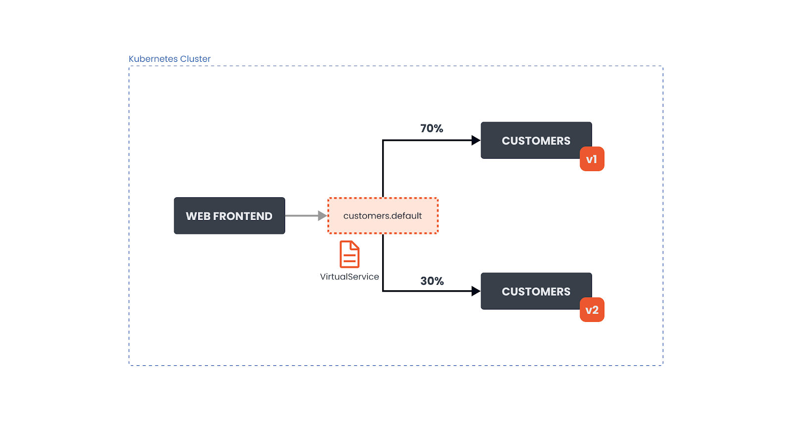
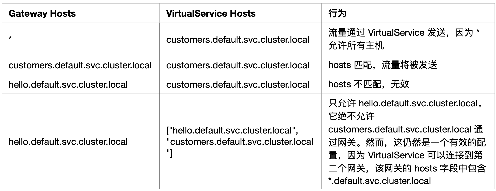

# 基本路由

我们可以使用 VirtualService 资源在 Istio 服务网格中进行流量路由。通过 VirtualService，我们可以定义流量路由规则，并在客户端试图连接到服务时应用这些规则。例如向 `dev.example.com` 发送一个请求，最终到达目标服务。

让我们看一下在集群中运行 `customers` 应用程序的两个版本（v1 和 v2）的例子。我们有两个 Kubernetes 部署，`customers-v1` 和 `customers-v2`。属于这些部署的 Pod 有一个标签 `version：v1` 或一个标签 `version：v2` 的设置。



我们想把 VirtualService 配置为将流量路由到应用程序的 V1 版本。70% 的传入流量应该被路由到 V1 版本。30% 的请求应该被发送到应用程序的 V2 版本。

下面是上述情况下 VirtualService 资源的样子：

```yaml
apiVersion: networking.istio.io/v1alpha3
kind: VirtualService
metadata:
  name: customers-route
spec:
  hosts:
  - customers.default.svc.cluster.local
  http:
  - name: customers-v1-routes
    route:
    - destination:
        host: customers.default.svc.cluster.local
        subset: v1
      weight: 70
  - name: customers-v2-routes
    route:
    - destination:
        host: customers.default.svc.cluster.local
        subset: v2
      weight: 30
```

在 `hosts` 字段下，我们要定义流量被发送到的目标主机。在我们的例子中，这就是 `customers.default.svc.cluster.local` Kubernetes 服务。

下一个字段是 `http`，这个字段包含一个 HTTP 流量的路由规则的有序列表。`destination` 是指服务注册表中的一个服务，也是路由规则处理后请求将被发送到的目的地。Istio 的服务注册表包含所有的 Kubernetes 服务，以及任何用 ServiceEntry 资源声明的服务。

我们也在设置每个目的地的权重（`weight`）。权重等于发送到每个子集的流量的比例。所有权重的总和应该是 100。如果我们有一个单一的目的地，权重被假定为 100。

通过 `gateways` 字段，我们还可以指定我们想要绑定这个 VirtualService 的网关名称。比如说：

```yaml
apiVersion: networking.istio.io/v1alpha3
kind: VirtualService
metadata:
  name: customers-route
spec:
  hosts:
    - customers.default.svc.cluster.local
  gateways:
    - my-gateway
  http:
    ...
```

上面的 YAML 将 `customers-route` VirtualService 绑定到名为 `my-gateway` 的网关上。这有效地暴露了通过网关的目标路由。

当一个 VirtualService 被附加到一个网关上时，只允许在网关资源中定义的主机。下表解释了网关资源中的 `hosts` 字段如何作为过滤器，以及 VirtualService 中的 `hosts` 字段如何作为匹配。



